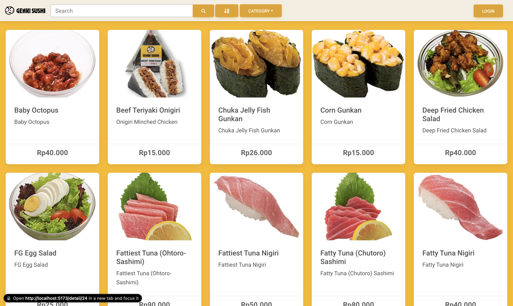

# Sushi Store

An online sushi store built with React for content management system (CMS).

## Table of Contents

- [Sushi Store](#sushi-store)
  - [Table of Contents](#table-of-contents)
  - [Introduction](#introduction)
  - [Features](#features)
  - [Tech Stack](#tech-stack)
  - [Installation](#installation)
    - [Prerequisites](#prerequisites)
    - [Prerequisites 2](#prerequisites-2)
    - [Setup Instructions](#setup-instructions)
  - [Screenshots](#screenshots)
    - [Homepage](#homepage)
  - [Contact Information](#contact-information)

## Introduction

This sushi store CMS website allows users to browse products, add a new product to the product list, edit existing product, and delete existing product (CRUD). The goal is to provide a seamless content management system experience.

## Features

- Content Management System (CMS) functionality.
- CRUD functionality.
- Product browsing with search and filtering.
- User authentication and authorization.

## Tech Stack

- **Frontend:** React, Vite, Bootstrap, Axios, Firebase, Toastify
- **Backend:** Node.js, Express, Sequelize ORM, JWT, Bcryptjs, Multer, Cloudinary, Jest, Supertest, Supabase, Google Cloud Platform (GCP)
- **Database:** PostgreSQL, Supabase

## Installation

### Prerequisites

- Node.js
- Supabase
- Firebase
- GCP

### Prerequisites 2

Set up your .env file with the following variables:

```env
PORT:
JWT_SECRET:
CLOUDINARY_CLOUD_NAME:
CLOUDINARY_API_KEY:
CLOUDINARY_API_SECRET:
```

### Setup Instructions

```bash
git clone https://github.com/daditsan/sushi-store.git
cd sushi-store
npm install
npm run dev
cd ..
cd client
npm install
npm run dev
```

Access the website at <http://localhost:5173>

## Screenshots

### Homepage



## Contact Information

For any questions or concerns, reach out to me at <dityaisanda@gmail.com>
Thank you.
